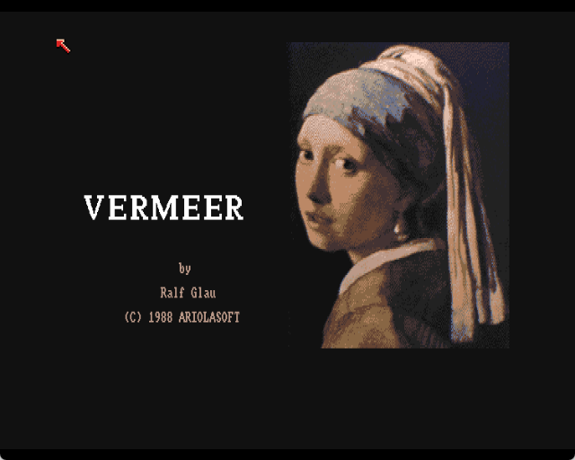
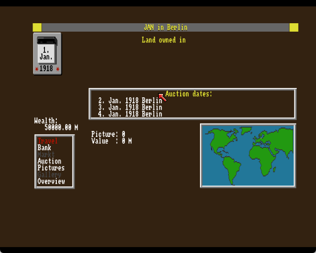
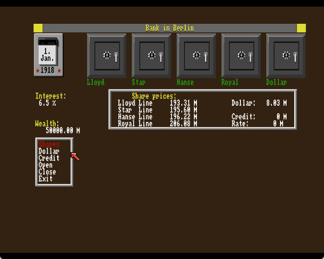
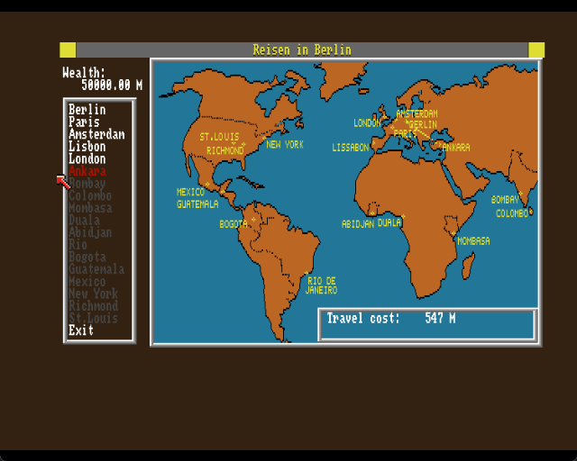

# Vermeer — English translation patch

A fan translation patch for *Vermeer* (Ariolasoft, 1988), the German
art-dealing economic simulation for the Amiga 500.



This repository does not contain the game. It contains a patch, and the
tools that build it, which turn your own copy of the German
`Vermeer (1988)(Ariolasoft)(DE).adf` into an English one.

You need:

* Your own dump of `Vermeer (1988)(Ariolasoft)(DE).adf` (901,120 bytes,
  standard 880K Amiga floppy image).
* FS-UAE, WinUAE or Amiberry, configured as an A500 with Kickstart 1.3 and
  512 KB.

## Apply the patch

`vermeer-en.ips` is a standard [IPS patch](https://zerosoft.zophar.net/ips.php).
Apply it with any IPS patcher — Floating IPS and Lunar IPS both work on
Windows — or with the script included here:

```
python tools/ips.py apply "Vermeer (1988)(Ariolasoft)(DE).adf" vermeer-en.ips "Vermeer (1988)(Ariolasoft)(EN).adf"
```

Load the resulting file as drive DF0 in your emulator. The disk boots
itself.

## Building from source

`translation/` holds the English text; `tools/build_en.py` rebuilds the
disk image (and the `.ips` patch) from your own German original:

```
python tools/build_en.py                            # DE image + translation/ -> EN image
python tools/build_en.py --report                    # ... and list every replacement
python tools/ips.py make "Vermeer (1988)(Ariolasoft)(DE).adf" "Vermeer (1988)(Ariolasoft)(EN).adf" vermeer-en.ips
python tools/adf.py "Vermeer (1988)(Ariolasoft)(EN).adf" check
```

The build refuses to produce an image unless every check passes: each
translation fits the space available for it, the executable comes through
with no byte changed outside a string slot, numeric game data is
untouched, and the rebuilt filesystem validates.

## What's translated

| Source | Coverage |
| --- | --- |
| `vermeer` (executable) | 195 of 354 display strings — the rest are runtime call names, file paths and punctuation |
| `DATEN.VAM` | 72 of 351 lines — menus, city names, painters, art periods, weekdays, months, crops; the remaining lines are numeric game data |
| `v.his/A` … `N` | all 14 files — 1918–1932 news headlines and random events |

Translations live in `translation/`: `exe.json` (keyed by executable file
offset), `daten.json` (keyed by line number in `DATEN.VAM`), and
`vhis/*.txt` (whole-file replacements). Only the English text is stored;
the German is read from your disk image at build time.

## Screenshots

| | |
|---|---|
|  |  |
|  | |

## Known limitations

* Two screen titles stay German: **Reisen in Berlin** (travel) and
  **Markt in Ankara** (market) — the city name is translated, "Reisen"
  and "Markt" are not. They're generated by code rather than stored as
  text, so a text patch can't reach them.
* The date-entry field pre-fills with the German mask `TT.MM`, for the
  same reason. It's overwritten as soon as you type.
* The world map has `LISSABON` and `RIO DE JANEIRO` painted into the
  graphic as pixels, not text.
* Dates read "24. May" rather than "May 24" — the day/month order is
  assembled in code.
* A few menu labels are shortened to fit a fixed-width slot the compiler
  reserved (e.g. `Job market`, `Exchange`).

## Development

`tools/uaectl.py` drives FS-UAE from the command line — screenshots,
mouse, keyboard — for testing changes to the translation. It expects
`fs-uae.exe` at the path in the `FS_UAE` environment variable and a
Kickstart 1.3 ROM at `build/uae/kick13.rom`. `tools/smoke_test.py` plays
through the opening screens and the main menus, saving a screenshot of
each to `build/uae/shots/`.

## License

The code and translation text in this repository are released under the
MIT license (see `LICENSE`). *Vermeer* itself is © 1988 Ariolasoft; no
game files are included here, and you must own a legal copy to use this
patch.
