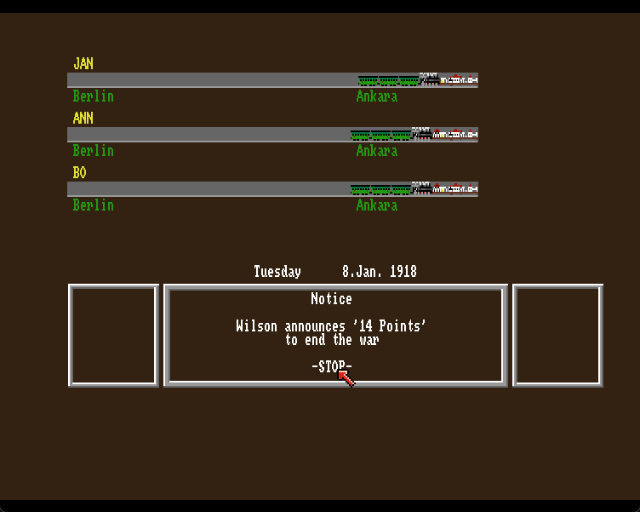
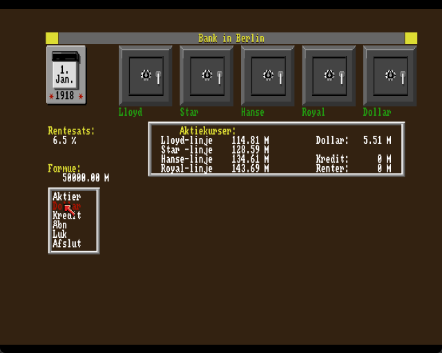

# Vermeer — English & Danish translation patches

Fan translation patches for *Vermeer* (Ariolasoft, 1988), the German
art-dealing economic simulation for the Amiga 500. English and Danish are
both supported.


This repository does not contain the game. It contains patches, and the
tools that build them, which turn your own copy of the German
`Vermeer (1988)(Ariolasoft)(DE).adf` into an English or Danish one.

You need:

* Your own dump of `Vermeer (1988)(Ariolasoft)(DE).adf` (901,120 bytes,
  standard 880K Amiga floppy image).
* FS-UAE, WinUAE or Amiberry, configured as an A500 with Kickstart 1.3 and
  512 KB.

## Apply the patch

`vermeer-en.ips` and `vermeer-da.ips` are standard
[IPS patches](https://zerosoft.zophar.net/ips.php). Apply either with any
IPS patcher — Floating IPS and Lunar IPS both work on Windows — or with
the script included here:

```
python tools/ips.py apply "Vermeer (1988)(Ariolasoft)(DE).adf" vermeer-en.ips "Vermeer (1988)(Ariolasoft)(EN).adf"
python tools/ips.py apply "Vermeer (1988)(Ariolasoft)(DE).adf" vermeer-da.ips "Vermeer (1988)(Ariolasoft)(DA).adf"
```

Load the resulting file as drive DF0 in your emulator. The disk boots
itself.

## Building from source

`translation/<lang>/` holds the translated text (`en` and `da`);
`tools/build.py` rebuilds the disk image (and the `.ips` patch) from your
own German original:

```
python tools/build.py --lang en                      # DE image + translation/en/ -> EN image
python tools/build.py --lang da                      # DE image + translation/da/ -> DA image
python tools/build.py --lang da --report              # ... and list every replacement
python tools/ips.py make "Vermeer (1988)(Ariolasoft)(DE).adf" "Vermeer (1988)(Ariolasoft)(DA).adf" vermeer-da.ips
python tools/adf.py "Vermeer (1988)(Ariolasoft)(DA).adf" check
```

The build refuses to produce an image unless every check passes: each
translation fits the space available for it, the executable comes through
with no byte changed outside a string slot, numeric game data is
untouched, and the rebuilt filesystem validates.

## What's translated

| Source | English coverage | Danish coverage |
| --- | --- | --- |
| `vermeer` (executable) | 195 of 354 display strings | 186 of 354 display strings |
| `DATEN.VAM` | 72 of 351 lines | 56 of 351 lines |
| `v.his/A` … `N` | all 14 files | all 14 files |

The rest of the executable's strings are runtime call names, file paths
and punctuation. The untranslated `DATEN.VAM` lines are numeric game data
plus, for Danish, entries that are already valid Danish as-is (city names
like `Bank`, `Kredit`, `Auktion`, `Lissabon`, `Dollar`, `Alle`). `v.his/A`
through `N` are 1918–1932 news headlines and random events, translated in
full for both languages.

Translations live in `translation/<lang>/`: `exe.json` (keyed by
executable file offset), `daten.json` (keyed by line number in
`DATEN.VAM`), and `vhis/*.txt` (whole-file replacements). Only the
translated text is stored; the German is read from your disk image at
build time.

## Screenshots

| | |
|---|---|
|  |  |
|  |  |

Danish:

| | |
|---|---|
|  |  |

## Known limitations

These apply to both languages, since both patch the same code:

* Two screen titles stay German: **Reisen in Berlin** (travel) and
  **Markt in Ankara** (market) — the city name is translated, "Reisen"
  and "Markt" are not. They're generated by code rather than stored as
  text, so a text patch can't reach them.
* The date-entry field pre-fills with the German mask `TT.MM`, for the
  same reason. It's overwritten as soon as you type.
* The world map has `LISSABON` and `RIO DE JANEIRO` painted into the
  graphic as pixels, not text.
* Dates read "24. May" / "24. maj" rather than "May 24" — the day/month
  order is assembled in code.
* A few menu labels are shortened to fit a fixed-width slot the compiler
  reserved (e.g. `Job market`/`Jobmarked`, `Exchange`/`Kurser`).

## Development

`tools/uaectl.py` drives FS-UAE from the command line — screenshots,
mouse, keyboard — for testing changes to the translation. It expects
`fs-uae.exe` at the path in the `FS_UAE` environment variable and a
Kickstart 1.3 ROM at `build/uae/kick13.rom`. `tools/smoke_test.py` plays
through the opening screens and the main menus, saving a screenshot of
each to `build/uae/shots/`.

## License

The code and translation text in this repository are released under the
MIT license (see `LICENSE`). *Vermeer* itself is © 1988 Ariolasoft; no
game files are included here, and you must own a legal copy to use this
patch.
